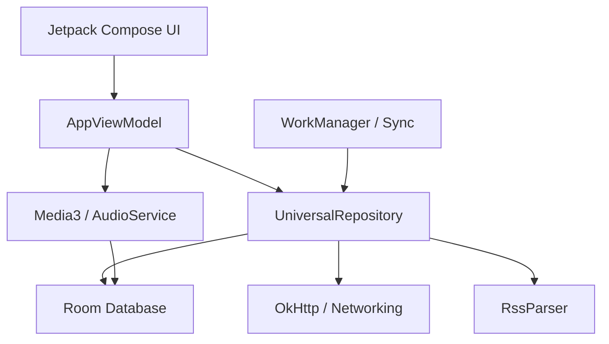

# Architecture: Alakey Podcast App

## High-Level Diagram
The application follows the modern Android MVVM (Model-View-ViewModel) architecture with a heavy emphasis on reactive streams (Kotlin Flow) and Unidirectional Data Flow (UDF) for the UI.

## Layers

### 1. Presentation Layer (UI)
- **Jetpack Compose**: The entire UI is built with Compose.
- **Glassmorphism**: Custom UI components (`PrismaticGlass`, `FluxBackground`) provide a premium aesthetic.
- **State Management**: The UI observes a single `UiState` flow from the `AppViewModel`.

### 2. Domain/ViewModel Layer
- **AppViewModel**: Orchestrates the interaction between the UI and the data layer. It manages Media3 `MediaController` and coordinates playback, sleep timers, and search results.
- **Dependency Injection**: Hilt is used to inject the `UniversalRepository` and other dependencies.

### 3. Data Layer
- **UniversalRepository**: A singleton repository that acts as the single source of truth.
- **Room Database**: 
    - `PodcastEntity`: Stores episode metadata, progress, and download status.
    - `PodcastDao`: Provides reactive access to the library and search results.
- **Networking**: OkHttp is used for RSS feed fetching and iTunes search.
- **RssParser**: A custom `XmlPullParser` implementation tailored for podcast RSS/Atom feeds.

### 4. Services & Workers
- **AudioService**: An `androidx.media3.session.MediaLibraryService` for background media playback.
- **FeedSyncWorker**: Periodically checks for new episodes in subscribed feeds.
- **AudioDownloadWorker**: Handles background downloading of MP3 files to local storage.

## Key Design Patterns
- **Repository Pattern**: Centralized data access.
- **Reactive Programming**: Extensive use of `StateFlow` and `SharedFlow`.
- **Proxying**: The repository uses `allorigins.win` as a fallback proxy for fetching feeds that might be blocked or have CORS issues (though CORS is less relevant for mobile, it helps bypass certain network restrictions).
- **Motion Sensing**: Integrates Android's `SensorManager` to detect physical movement for the sleep timer extension feature.
