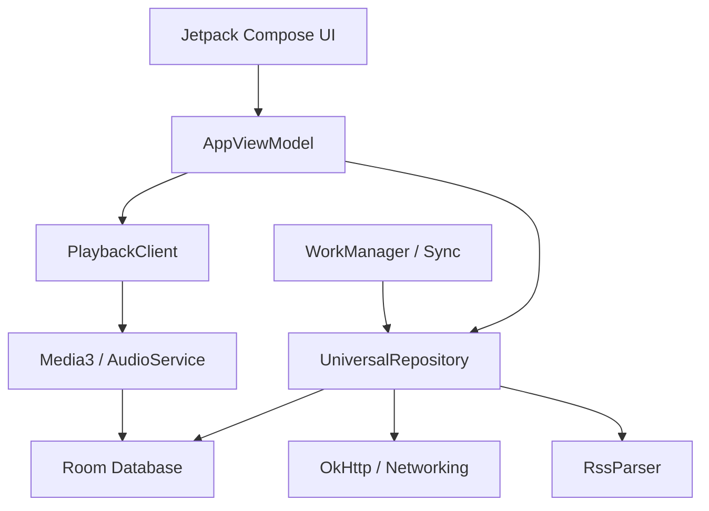

# Architecture: Alakey Podcast App

## High-Level Diagram
The application follows the modern Android MVVM (Model-View-ViewModel) architecture with a heavy emphasis on reactive streams (Kotlin Flow) and Unidirectional Data Flow (UDF) for the UI.

## Layers

### 1. Presentation Layer (UI)
- **Jetpack Compose**: The entire UI is built with Compose.
- **Glassmorphism**: Custom UI components (`PrismaticGlass`, `FluxBackground`) provide a premium aesthetic.
- **Spec-Driven Components**: UI components (like `GlassPodcastRow`) are decoupled from database entities, consuming pure data "Specs". This enables multi-source data (e.g., Search API + Local DB) to use the same high-fidelity UI.
- **Flattened LazyColumn**: The library list is architected as a flattened structure to prevent ANR issues when handling large feeds (3000+ episodes).
- **State Management**: The UI observes a single `UiState` flow from the `AppViewModel` (Pure Unidirectional Data Flow).

### 2. Domain/ViewModel Layer
- **AppViewModel**: Orchestrates the interaction between the UI and the data layer. It maps data from the repository and playback state from the `PlaybackClient` into a consumable `UiState`.
- **PlaybackClient**: A dedicated component for managing `MediaController` connections, sleep timers, and progress polling. Extracted from the ViewModel to de-complect business logic from session management.
- **Dependency Injection**: Hilt is used to inject repositories, clients, and other singletons.

### 3. Data Layer
- **UniversalRepository**: A singleton repository that acts as the single source of truth.
- **Room Database**: 
    - `PodcastEntity`: Stores episode metadata, progress, and download status.
    - `PodcastDao`: Provides reactive access to the library and search results.
- **Networking**: OkHttp is used for RSS feed fetching and iTunes search.
- **RssParser**: A custom `XmlPullParser` implementation tailored for podcast RSS/Atom feeds.

### 4. Services & Workers
- **AudioService**: An `androidx.media3.session.MediaLibraryService` for background media playback.
- **FeedSyncWorker**: Periodically checks for new episodes in subscribed feeds.
- **AudioDownloadWorker**: Handles background downloading of MP3 files to local storage.

## Key Design Patterns
- **De-complected Architecture**: Heavy emphasis on separating "Intent" from "Mechanism". Components like `PlaybackClient` and `RssParser` are decoupled from Android lifecycle and IO where possible.
- **Information Model (Facts)**: Implements an EAV-style fact registry (`FactEntity`) for flexible, schema-less data storage.
- **Repository Pattern**: Centralized data access via `UniversalRepository`.
- **Reactive Programming**: Extensive use of `StateFlow` and `SharedFlow`.
- **REPL-Driven Debugging**: Includes a `ReplReceiver` for executing SQL, asserting facts, and triggering playback via ADB broadcasts.
- **Motion Sensing**: Integrates Android's `SensorManager` to detect physical movement for the sleep timer extension feature.
